# Snoopy: A Scalable Oblivious Storage System
Snoopy is a high-throughput oblivious storage system that scales similarly to a plaintext storage system. This implementation contains our Snoopy system as described in the forthcoming SOSP’21 paper.

**WARNING:** This is an academic proof-of-concept prototype and has not received careful code review. This implementation is NOT ready for production use.

This prototype is released under the Apache v2 license (see [License](LICENSE)).

# Artifact Evaluation
## Overview
* [Baselines](#baselines)
    * [Oblix](#oblix) (5 compute-minutes)
    * [Obladi](#obladi) (15 compute-minutes)
    * [Propagate Baselines](#propagate-baselines) (<1 minute)
* [Provisioning Machines for Snoopy](#provisioning-machines-for-snoopy) (5 compute-minutes)
* [Figure 9](#figure-9) (195 compute-minutes)
* [Figure 10a](#figure-10a) (35 compute-minutes)
* [Figure 10b](#figure-10b) (10 compute-minutes)
* [Figure 11a, 11b, 11c](#figure-11a-11b-11c) (6 compute-minutes)
* [Figure 12a](#figure-12a) (2 compute-minutes)
* [Figure 12b](#figure-12b) (12 compute-minutes)
* [Figure 13](#figure-13) (160 compute-minutes) 
* [Figure 14a, 14b](#figure-14a-14b) (2 compute-minutes)
* [Cleanup](#cleanup) (10 compute-minutes)
* [Comparing Figures](#comparing-figures) (20 human-minutes)


For our experiments, we will use a cluster of Azure confidential computing instances. Reviewers should have been provided with credentials to our Azure environment. Due to Azure resource quotas, we can only support one reviewer evaluating at a time. The entire artifact evaluation takes around 30 human-minutes and 7 compute-hours to complete.

All experiments produce `.dat` files in subfolders of `~/snoopy/experiments/results`. These files are used to plot each figure that appears in the paper's evaluation, which are output in `~/snoopy/experiments/artifact_figures`. All of the data files used in the paper's evaluation graphs can be found in `~/snoopy/experiments/artifact_figures/paper`.

Only the baselines can be run concurrently. Both baselines must finish running before you start running any of the figures. The figures can be run in any order, **except** Figure 14, which must be run after Figure 11a, 11b, and 11c.

Each figure script is pretty automatic, i.e., you enter one command and the experiment(s) for that figure are run and plotted for you. Each experiment maintains a progress bar to give you an estimate of how much time is remaining.

## Baselines
The Oblix and Obladi baselines can be run in parallel because they use different clusters. We recommend running the commands in two tmux windows.

### Oblix
```sh
cd ~/snoopy/scripts/oblix
python3 runExperiment.py --config=config/oblix_benchmark.json -psrc     # 5 minutes
```
The above command can be broken down as follows:

* `-p` launches a cluster of 1 Azure SGX VM with an image that has [Oblix](https://people.eecs.berkeley.edu/~raluca/oblix.pdf) installed.
* `-s` sets up a new experiment directory and symlinks it to `~/snoopy/experiments/oblix_benchmark/latest`.
* `-r` runs the Oblix benchmark, which measures the latencies of accessing oblivious storages containing 10-2M blocks. We use the latency of accessing 2M blocks in Figure 9 (in order to calculate the baseline throughput), Figure 10b (baseline latency), Figure 13 (in order to emulate using Oblix as a subORAM).
* `-c` destroys the cluster. 

### Obladi
```sh
cd ~/snoopy/scripts/obladi
python3 runExperiment.py -psrc      # 15 minutes
```
The above command can be broken down as follows:
* `-p` launches an [Obladi](https://www.usenix.org/system/files/osdi18-crooks.pdf) cluster of 2 VMs.
* `-s` sets up a new experiment directory and symlinks it to `~/snoopy/experiments/diff-clients-base-oram-par-server-1/latest`. It compiles Obladi and sends the compiled jar files to the remote Obladi cluster.
* `-r` runs the Obladi benchmark, which measures the throughput of accessing an oblivious storage containing 2M blocks. We use this throughput to plot Figure 9.
* `-c` destroys the cluster. 

### Propagate Baselines
After running the Obladi and Oblix baselines, run the following command to propagate their values for future figures and experiments:

```sh
cd ~/snoopy/scripts
./process_baselines.sh      # <1 minute
```

## Provisioning Machines for Snoopy
```sh
cd ~/snoopy/scripts
./provision_machines.sh     # 5 minutes
```
The above command launches a cluster of 21 Azure SGX VMs and updates the experiment config files with the machines' IP addresses. It costs ~$370/per day to run this cluster, so please [destroy](#cleanup) the cluster when you are done with artifact evaluation.

The rest of the instructions assume that your current working directory is `~/snoopy/scripts`.


## Figure 9
```sh
./figure9.sh      # 195 minutes
```
This command runs 3 experiments and then plots the data for Figure 9 showing the affect of increasing machines on total system throughput.

The graph will be located in `~/snoopy/experiments/artifact_figures/9.pdf`. The artifact evaluation graph is drawn on the left, and the graph in the paper is drawn on the right.
<details>
<summary>Sample Figure 9 output</summary>
    
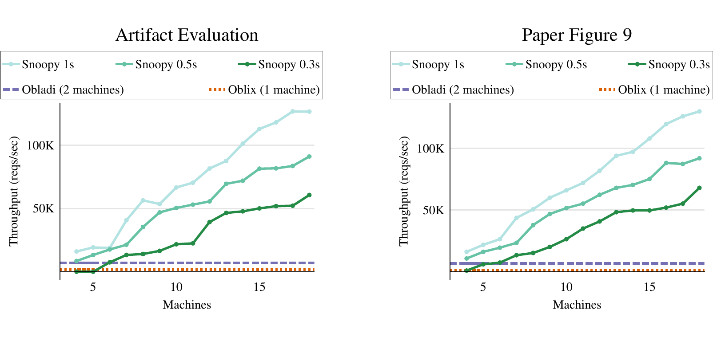
</details>
There may be some variance between the artifact and paper graph, but their trends should strongly resemble each other. This is due to the artifact only measuring requests for 10 seconds/iteration instead of 20 seconds to save on time.

## Figure 10a
```sh
python3 runExperiment.py -f 10a -srg        # 35 minutes
```
This command runs 1 experiment and then plots the data for Figure 10a showing how the number of total blocks in Snoopy increases with increasing the number of subORAMs while maintaining a mean request latency of 160ms.

The graph will be located in `~/snoopy/experiments/artifact_figures/10a.pdf`. The artifact evaluation graph is drawn on the left, and the graph in the paper is drawn on the right.
<details>
<summary>Sample Figure 10a output</summary>
    
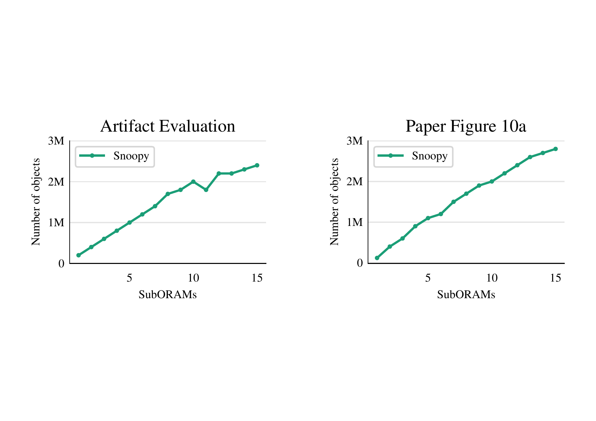
</details>
Again, there may be some variance between the artifact and paper graph, but their trends should strongly resemble each other. This is due to the artifact only measuring requests for 10 seconds/iteration instead of 20 seconds to save on time.

## Figure 10b
```sh
python3 runExperiment.py -f 10b -srg        # 10 minutes
```
This command runs 1 experiment and then plots the data for Figure 10b showing how the mean request latency in Snoopy decreases with increasing the number of subORAMs.

The graph will be located in `~/snoopy/experiments/artifact_figures/10b.pdf`. The artifact evaluation graph is drawn on the left, and the graph in the paper is drawn on the right.
<details>
<summary>Sample Figure 10b output</summary>
    
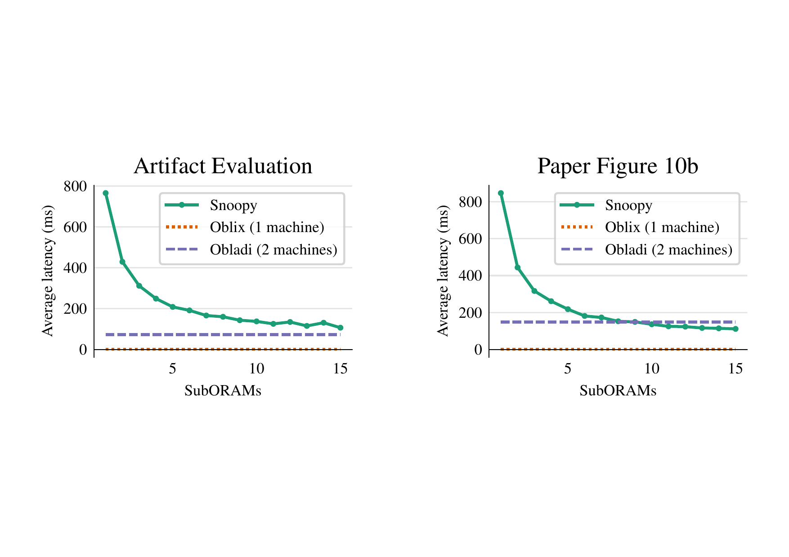
</details>

## Figure 11a, 11b, 11c
```sh
./figure11.sh     # 6 minutes
```
This command runs 3 experiments and then plots the data for Figure 11a, 11b, and 11c, showing the performance breakdowns for processing a batch in Snoopy while varying the number of requests in each batch. Figure 11a shows this breakdown for a data size of 2^10 objects, Figure 11b shows 2^15 objects, and Figure 11c shows 2^20 total objects.

<details>
<summary>Sample Figure 11a, 11b, 11c output</summary>
    
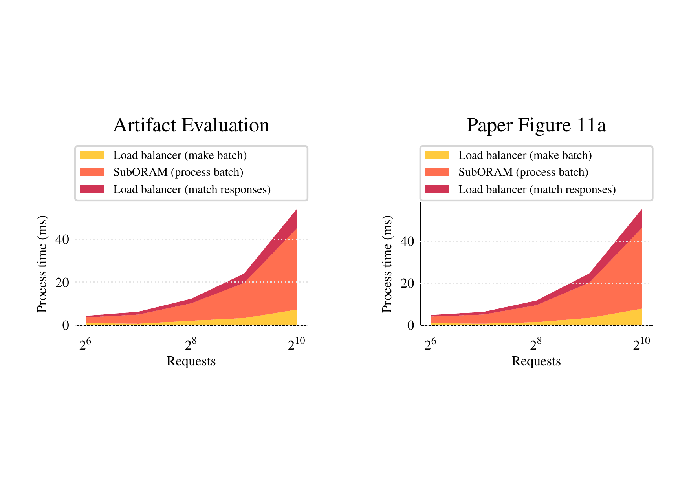
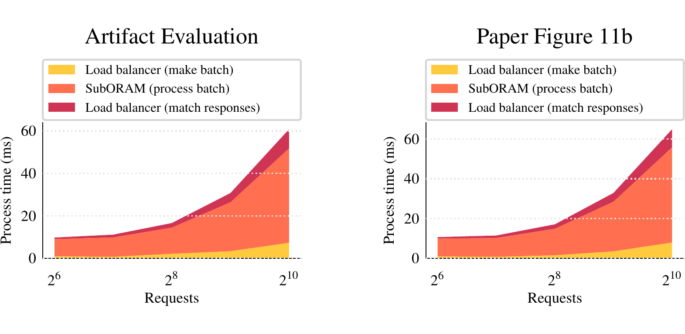
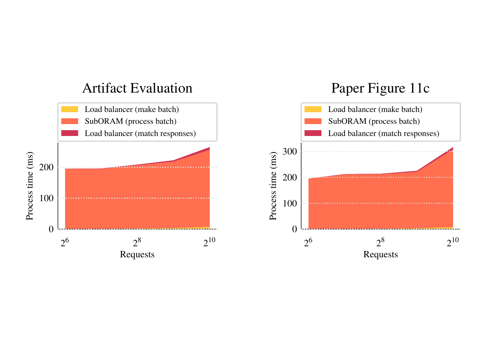
</details>

## Figure 12a
```sh
python3 runExperiment.py -f 12a -srg      # 2 minutes
```
This command runs 1 experiment and then plots the data for Figure 12a, showing the performance of bitonic sort using multiple threads.

<details>
<summary>Sample Figure 12a output</summary>
    
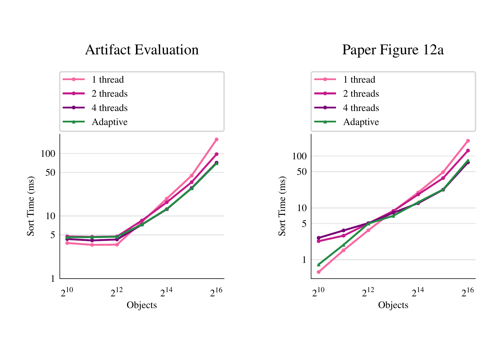
</details>

## Figure 12b
```sh
python3 runExperiment.py -f 12b -srg      # 12 minutes
```
This command runs 1 experiment and then plots the data for Figure 12a, showing the performance of a subORAM processing a batch using multiple threads.

<details>
<summary>Sample Figure 12b output</summary>
    
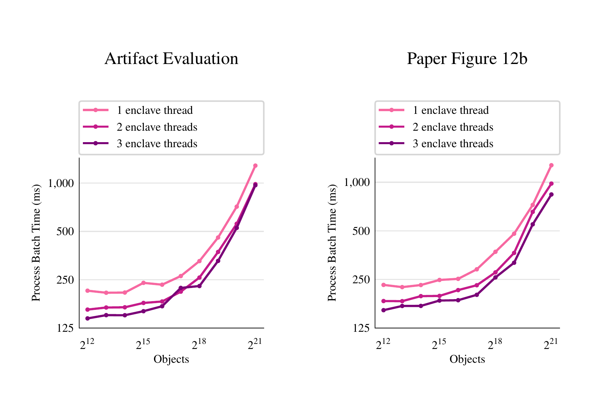
</details>

## Figure 13
```sh
./figure13.sh     # 160 minutes
```
This command runs 3 experiments and then plots the data for Figure 13 showing the affect of increasing machines on Snoopy where the subORAMs are replaced with Oblix.

<details>
<summary>Sample Figure 13 output</summary>
    
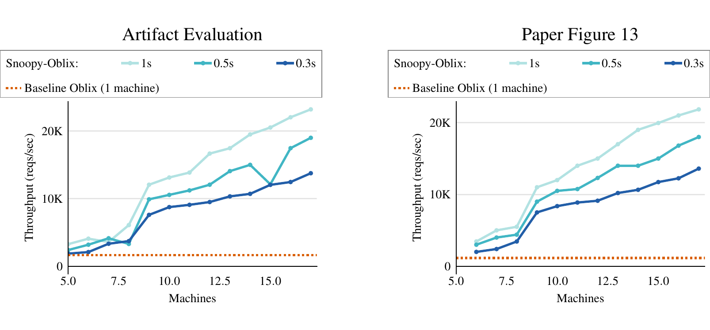
</details>
Again, there may be some variance between the artifact and paper graph, but their trends should strongly resemble each other. This is due to the artifact only measuring requests for 10 seconds/iteration instead of 20 seconds to save on time.

## Figure 14a, 14b
**PREREQUISITE: Requires [Figure 11a, 11b, and 11c](#figure-11a-11b-11c).**
```sh
./figure14.sh     # 2 minutes
```
This command runs the planner using the microbenchmarks collected in Figure 11's experiments and plots Figures 14a, 14b which show the optimal system configuration as throughput requirements increase for different data sizes.

<details>
<summary>Sample Figure 14a, 14b output</summary>
   
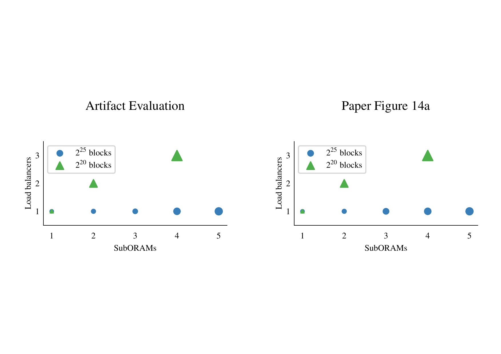
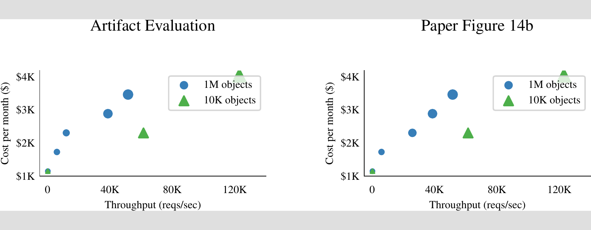
</details>

## Cleanup
```sh
python3 runExperiment.py -c     # 10 minutes
```
This command destroys the cluster. **Please remember to run this when you are done with artifact evaluation.** It costs ~$370/per day to run the cluster!

## Comparing Figures
All figures produced by this artifact are located in `~/snoopy/experiments/artifact_figures`. We recommend scp'ing this folder to your local computer so you can easily view each PDF. In each PDF, the artifact evaluation graph is drawn on the left and the graph in the paper is drawn on the right.

<details>
<summary>Sample Figure 9 output</summary>
    

</details>

<details>
<summary>Sample Figure 10a output</summary>
    

</details>

<details>
<summary>Sample Figure 10b output</summary>
    

</details>

<details>
<summary>Sample Figure 11a, 11b, 11c output</summary>
    


</details>

<details>
<summary>Sample Figure 12a output</summary>
    

</details>

<details>
<summary>Sample Figure 12b output</summary>
    

</details>

<details>
<summary>Sample Figure 13 output</summary>
    

</details>

<details>
<summary>Sample Figure 14a, 14b output</summary>
   


</details>

# Playing with Snoopy
## Building Snoopy Locally

Make sure submodules are cloned recurisvely:

```sh
git submodule update --init --recursive
```

You could also have cloned this repo with `git clone --recursive REPO_URL` to do this automatically.

**On Ubuntu 20.04 or later, you will need to install g++-7 and replace all instances of `cmake` with `CXX=g++-7 cmake` in the below commands.** This code relies on intrinsic builtins present in g++ 7 but not later versions of g++.

Protobuf:
```sh
# On ubuntu 18.04
sudo apt-get install build-essential autoconf libtool pkg-config automake zlib1g-dev
cd third_party/protobuf
mkdir build
cd build
cmake -Dprotobuf_BUILD_TESTS=OFF -DCMAKE_BUILD_TYPE=Release -DCMAKE_INSTALL_PREFIX=`pwd`/../install ../cmake
make -j
make install
```

gRPC (requires protobuf first):
```sh
cd third_party/grpc
mkdir build
cd build
cmake -DCMAKE_PREFIX_PATH=`pwd`/../../protobuf/install -DgRPC_INSTALL=ON -DgRPC_BUILD_TESTS=OFF \
      -DgRPC_PROTOBUF_PROVIDER=package -DgRPC_ZLIB_PROVIDER=package -DgRPC_CARES_PROVIDER=module -DgRPC_SSL_PROVIDER=package \
      -DCMAKE_BUILD_TYPE=Release \
      -DCMAKE_INSTALL_PREFIX=`pwd`/../install \
      ../
make -j
make install
```

Need to put boost library in `/usr/local/` (doesn't need to be built or installed).

Compile Snoopy:
```sh
mkdir build
cmake ..
make -j suboram && make -j
```

Running anything in the `scripts` directory:

Follow instructions here: https://docs.microsoft.com/en-us/azure/developer/python/configure-local-development-environment?tabs=cmd
```sh
pip install -r requirements.txt
export AZURE_SUBSCRIPTION_ID=<azure-subscription-id>
```

## Debugging

- Make sure DEBUG is turned on in enc.conf and OE_FLAG_DEBUG is passed into enclave creation

- Make debug build:
```
mkdir debug
cd debug
cmake -DCMAKE_BUILD_TYPE=Debug ..
make
```

Run oegdb as usual:
```sh
/opt/openenclave/bin/oegdb --args ...
```

Handle SIGILL:
```sh
(gdb) handle SIGILL nostop
```
